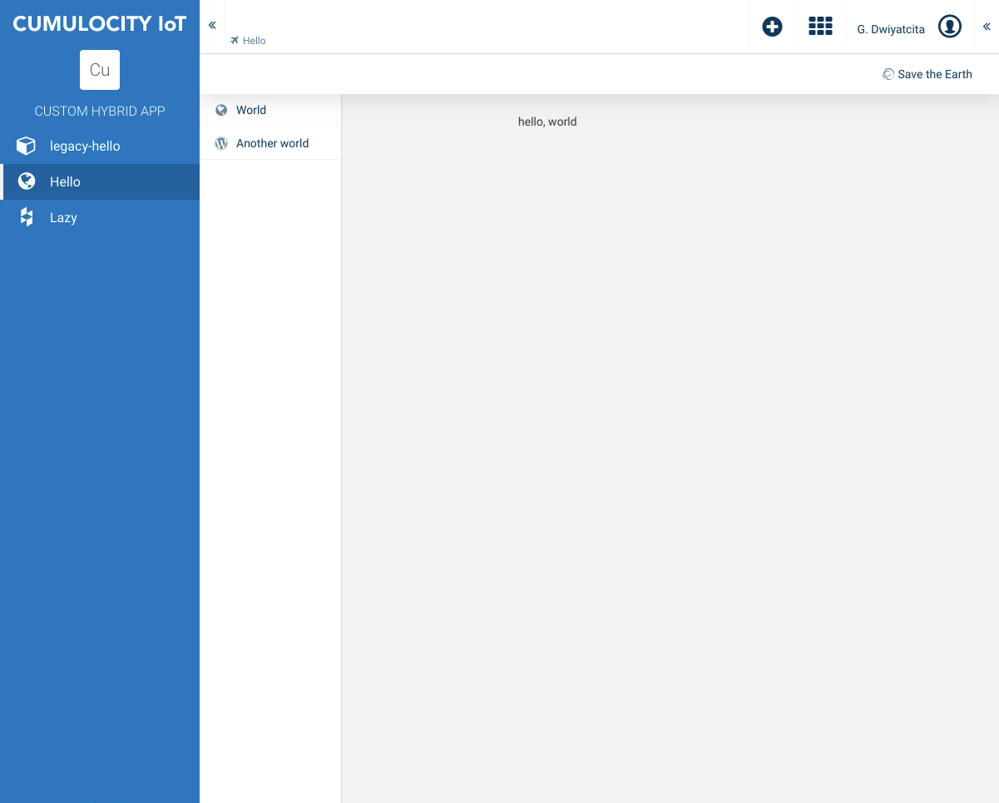

# cumulocity-custom-hybrid-app

[](https://www.npmjs.com/package/cumulocity-custom-hybrid-app)
[](http://npm-stat.com/charts.html?package=cumulocity-custom-hybrid-app)
[](https://raw.githubusercontent.com/dwiyatci/cumulocity-custom-hybrid-app/master/LICENSE.txt)

A Cumulocity base custom hybrid app "trait" for constructing custom hybrid apps with modular patterns and fundamental hooks usage.



### Why?

After all is really said and done: make less effort to answer repeated questions. Care less about that "pebbles and sands" bombardment. Come to the office later, go home sooner. Travel places, give more meaning to life, fill my obituary with the values that truly matter.

## Installation

- Make sure you have Node.js LTS installed and npm from its [website](https://nodejs.org), or better even, use [nvm](https://github.com/creationix/nvm).

- Install [yarn](https://yarnpkg.com/en/docs/install).

- Clone the repo, `cd` to your project directory.

- Set the `@c8y/*` packages released (UI build) version you want to develop against:

```bash
$ yarn use-c8y <@c8y_packages_version>
```

e.g.

```bash
$ yarn use-c8y 1005.1.0
```

- Install dependencies:

```bash
$ yarn install:clean
```

## Usage

- Create new or drop existing (legacy) AngularJS plugins under `src/ajs-plugins` directory. Adjust `src/index.ts` to import those plugins into the realm of Angular.

- Add Angular feature modules under `src/app` directory (some example feature modules have been done: `HelloModule`, `LazyModule`). [Follow the Style Guide, Old Sport!](https://angular.io/guide/styleguide)

- To extend/adapt one of the default applications (i.e. Administration, Device management, or Cockpit), find the "ng1 imports" of the app under `node_modules/@c8y/apps/{administration,devicemanagement,cockpit}/ng1.ts`, and adjust `src/ng1.ts` and `src/app.module.ts` accordingly.

- Start your development server:

```bash
$ yarn start -u <your_tenant_url>
```

- Find the running custom hybrid app at: <http://localhost:9000/apps/customhybridapp/>.

## Unit testing

```bash
$ yarn test
```

## Build

```bash
$ yarn build
```

## Deploy

- interactive:

```bash
$ yarn deploy
```

- non-interactive:

```bash
$ yarn deploy -u <your_tenant_url> -T <your_tenant> -U <your_username> -P <your_username_password>
```

## TODO

- [ ] 🏞️ Integrate "ng1" unit testing infrastructure for legacy plugins (extremely windy road ahead).

## Author

Glenn Dwiyatcita ([@dwiyatci](http://tiny.cc/dwiyatci))

## License

MIT.

See [LICENSE.txt](LICENSE.txt).
